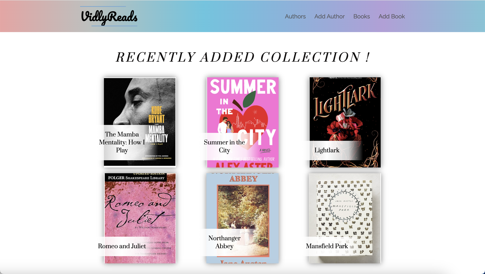
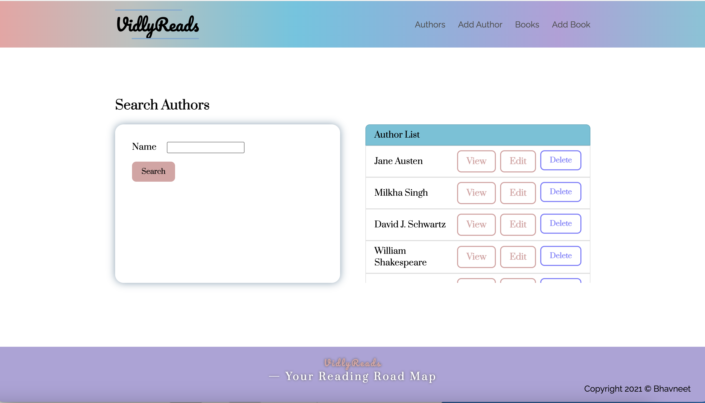
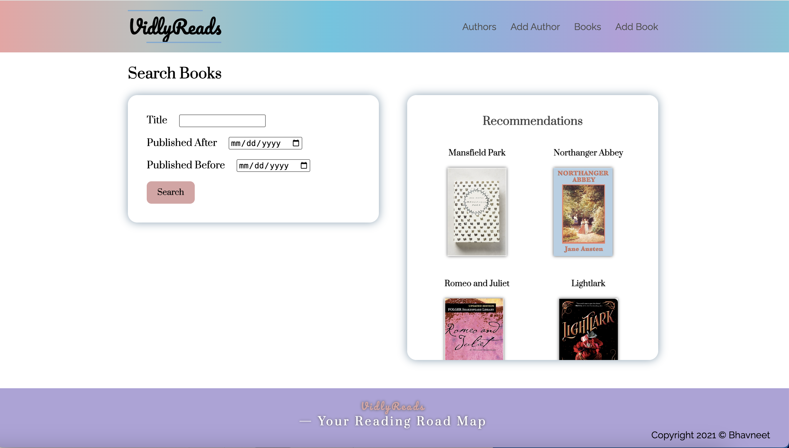
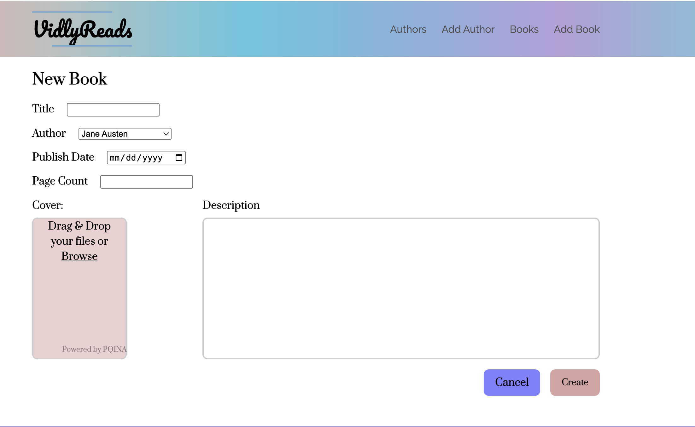

# VidlyReads

VidlyReads is a full stack personal library manager built with Node.js, Express, MongoDB, and EJS. It lets you manage book and author entries (metadata) through a simple web interface. You can add books with cover images, search by title or author, and browse recently added items. The project is ideal for learning how backend CRUD operations work with real-world UI flow and basic validations.

**Live Demo:** [https://vidlyreads.onrender.com](https://vidlyreads.onrender.com)  
*Note: This demo is publicly editable. Please don't abuse the data, it's for learning/demo purposes only.*

---

## Features

- Add, edit, and delete books and authors
- Upload cover images via FilePond (base64 encoded)
- View recently added books on the homepage
- Prevent deletion of authors who have associated books
- Search functionality for both authors and books
- Clean layout built with EJS and express-ejs-layouts
- Deployed on Render (may have cold start delays)

---

## UI

### Homepage – Recently Added Books  


### Search Authors  


### Search Books 


### Add New Book Form  


---

## Tech Stack

- **Backend:** Node.js, Express.js  
- **Frontend:** EJS templates  
- **Database:** MongoDB + Mongoose  
- **File Upload (Client-side):** FilePond with base64 plugin  
- **Templating Layout:** express-ejs-layouts  
- **Other:** method-override, dotenv

---

## Getting Started

### Prerequisites

- Node.js and npm
- A MongoDB connection string (e.g. MongoDB Atlas)
- Git

### Installation

1. Clone the repository :

    ```bash
    git clone https://github.com/bhavneet334/VidlyReads.git
    cd VidlyReads
    ```

2. Install the dependencies : 

    ```npm install```

3. Create a .env file in the root directory with the following:

    ```MONGO_URI=your_mongodb_connection_string```

4. Start the development server : 

    ```npm start```

The application will be available at http://localhost:3000. 

### Project Structure
```
VidlyReads/
├── models/
├── public/
├── routes/
├── screenshots/
├── views/
├── .env              # Environment variable (not committed)
├── .gitignore
├── package.json
├── package-lock.json
├── README.md
└── server.js
```

### Notes
- Authors with existing books cannot be deleted.
- Server logs MongoDB connection and port info at startup.
- All image previews and uploads use FilePond’s resize and encode plugins.

### Author
Built by [Bhavneet Kaur](https://github.com/bhavneet334)  
Feel free to explore, fork, or contribute.